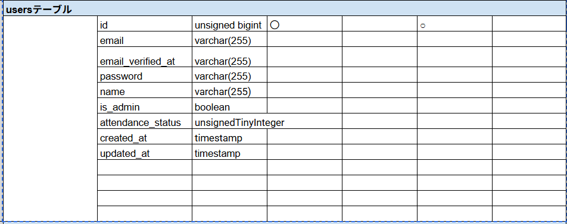
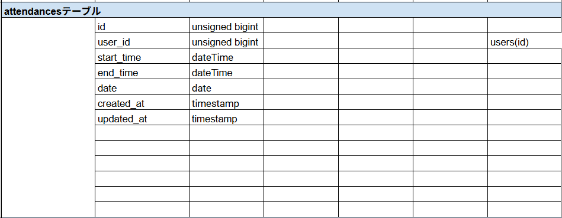
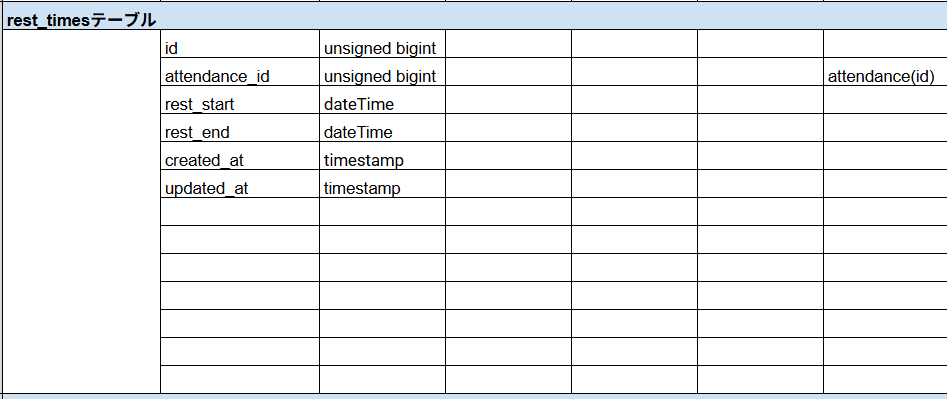
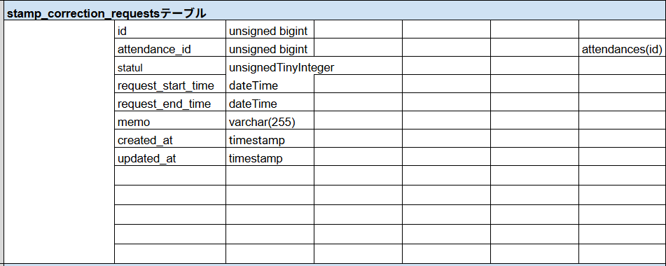
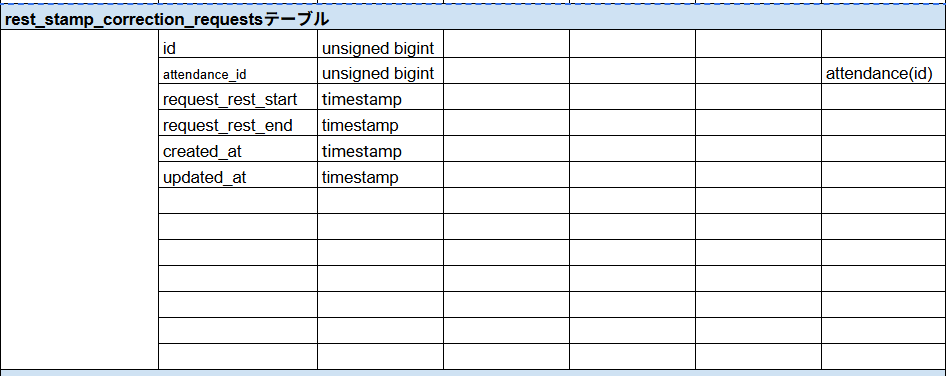
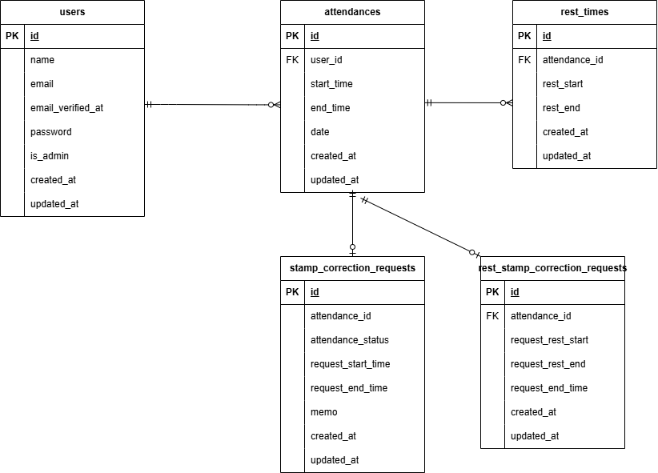

# coachtech勤怠管理アプリ

## 環境構築
**Dockerビルド**
1. `git@github.com:Toriyamayoshihiro/test2.git
2. DockerDesktopアプリを立ち上げる
3. `docker-compose up -d --build`

> *MacのM1・M2チップのPCの場合、`no matching manifest for linux/arm64/v8 in the manifest list entries`のメッセージが表示されビルドができないことがあります。
エラーが発生する場合は、docker-compose.ymlファイルの「mysql」内に「platform」の項目を追加で記載してください*
``` bash
mysql:
    platform: linux/x86_64(この文追加)
    image: mysql:8.0.26
    environment:
```

**Laravel環境構築**
1. `docker-compose exec php bash`
2. `composer install`
3. 「.env.example」ファイルを 「.env」ファイルに命名を変更。
4. .envに以下を設定
``` text
DB_CONNECTION=mysql
DB_HOST=mysql
DB_PORT=3306
DB_DATABASE=laravel_db
DB_USERNAME=laravel_user
DB_PASSWORD=laravel_pass

MAIL_MAILER=smtp
MAIL_HOST=mailhog
MAIL_PORT=1025
MAIL_USERNAME=sample
MAIL_PASSWORD=sample
MAIL_ENCRYPTION=null
MAIL_FROM_ADDRESS=sample@laravel.jp
MAIL_FROM_NAME="${APP_NAME}"


```


5. アプリケーションキーの作成
``` bash
php artisan key:generate
```

6. マイグレーションの実行
``` bash
php artisan migrate
```

7. シーディングの実行
``` bash
php artisan db:seed
```


## 使用技術(実行環境)
- PHP8.1.33
- Laravel 8.83.29
- MySQL8.0.26
- nginx:1.21.1
- MailHog


## テスト実行方法

### テスト用データベース作成

```bash
docker-compose exec mysql bash
mysql -u root -p
```

パスワードは `root` を入力します。

```sql
CREATE DATABASE demo_test;
```

### .env.testing 設定

```env
APP_ENV=test
APP_KEY=

DB_CONNECTION=mysql
DB_HOST=mysql
DB_PORT=3306
DB_DATABASE=demo_test
DB_USERNAME=root
DB_PASSWORD=root
```

### テスト用APP_KEY作成

```bash
docker-compose exec php bash
php artisan key:generate --env=testing
```

### テスト実行

```bash
php artisan test
```

または

```bash
vendor/bin/phpunit
```
## MailHog
会員登録・メール認証メールはMailHogで確認できます。


## テーブル仕様書

### users


### attendances


### rest_times


### stamp_correction_requests


### rest_stamp_correction_requests



## ER図


## URL
- 開発環境：http://localhost/
- phpMyAdmin:：http://localhost:8080/
- mailhog::http://localhost:8025
